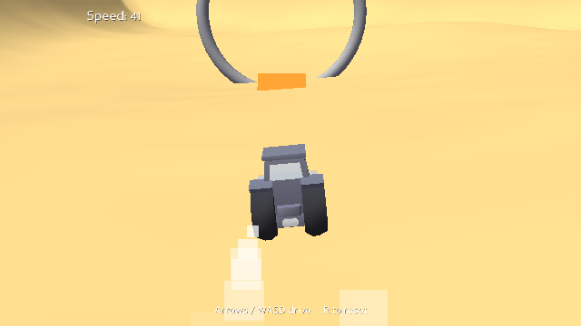
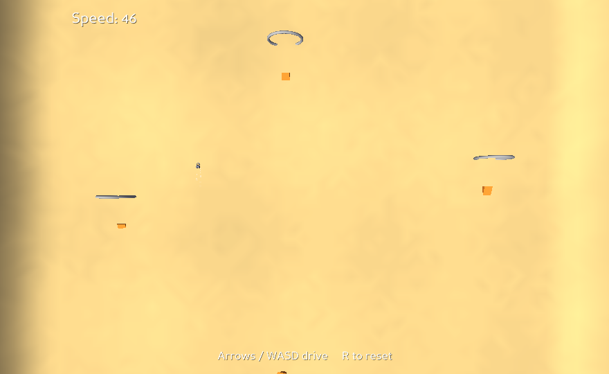
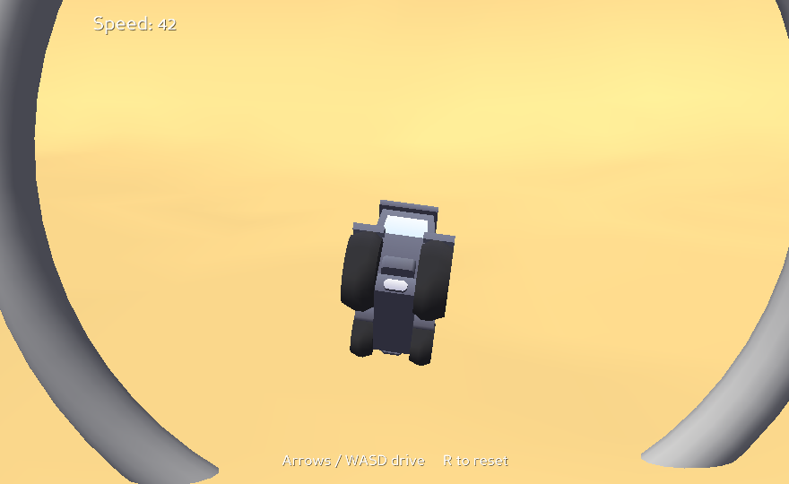
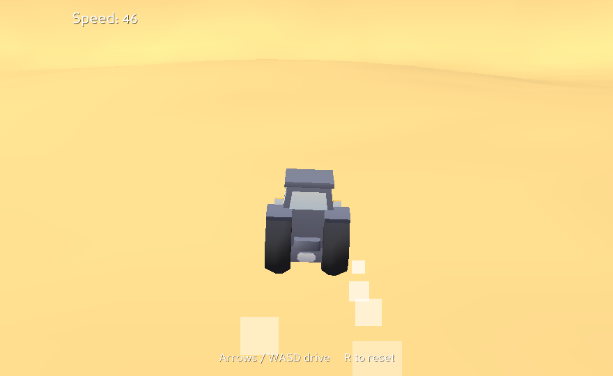

# Dune Buggy Sandbox

A drivable dune-buggy sandbox built with **Panda3D** and its built-in **Bullet**
vehicle physics. Tear across procedural heightfield dunes, launch off ramps, and
fly through big loop rings.



## Features
- **Bullet vehicle** — wheels, suspension, steering and grip; tunable "feel".
- **Procedural terrain** — rolling heightfield dunes with a tall raised rim (plus
  an invisible backstop) so you never drive out of bounds.
- **Chase camera** that trails behind and swings around through turns.
- **Ramp → loop combo stations** — 4 jump ramps and 3 big rings; hit a ramp with
  speed and fly straight through the loop.
- **Feel & feedback** — dust puffs off the wheels, an engine note that rises with
  speed, and a whoosh when you catch air. Press **R** to flip upright.

## Controls
| Key | Action |
|-----|--------|
| W / ↑ | accelerate |
| S / ↓ | brake, then reverse |
| A / D / ← / → | steer |
| R | flip the buggy upright |
| Esc | quit |

## Run
```bash
pip install panda3d
python dune_buggy_sandbox.py
```
Terrain, ramps, loops, wheels and dust are all generated in code, so the game
runs on its own. The buggy body is an optional external **CC0** model (a Kenney
car kit); without it the buggy falls back to a simple placeholder box.

Pass `--frames N` to run headless for N task-manager frames and exit (no
window, no audio) — handy for CI smoke tests: `python dune_buggy_sandbox.py --frames 5`.

## Tests
```bash
pip install -r requirements.txt && python -m pytest
```

## Screenshots
| Overview | Jump through a loop | Dunes |
|---|---|---|
|  |  |  |

## Tech
Panda3D · Bullet physics · GeoMipTerrain heightfield · procedural geometry (torus
loops, wedge ramps, wheels) · GLSL-free.
